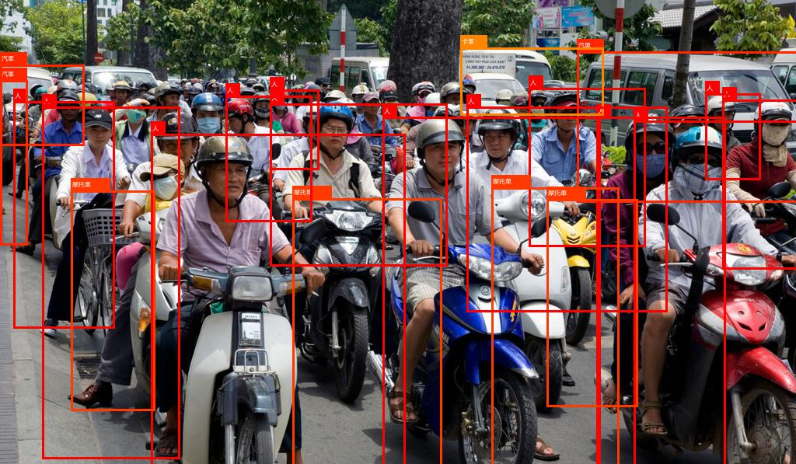
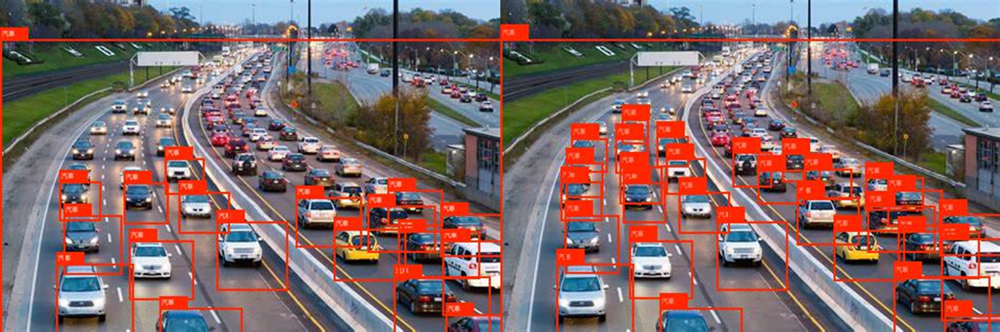

## Yolo v4 for pytorch , tensorflow eager mode and onnx (by trident api)

### thanks for
All the pretrined model weights and cfg is from official site:

https://github.com/AlexeyAB/darknet
[yolov4.cfg](https://raw.githubusercontent.com/AlexeyAB/darknet/master/cfg/yolov4.cfg)     
[yolov4.weights](https://drive.google.com/open?id=1cewMfusmPjYWbrnuJRuKhPMwRe_b9PaT)       

And thanks ultralytics's project, it's really great and helpful.     
https://github.com/ultralytics/yolov3

### results by yolo v4
Let's look  the excellent performance about yolo v4 (pytorch backend)!!

### update (5/3): small item enhance
In yolo v4 have the shortage about missing detection of small itemes. 
I try to fix the shortage. I found out The best way to fix  the issue is modify the objectness in stride=8 Yolo Layer (76*76)

all you need to do is set YoloLayer small_item_enhance=True (only effect 76*76 head)

    for module in detector.model.modules():
        if isinstance(module,YoloLayer):
            detector.eval()
            module.small_item_enhance=True

### update (5/11): onnx video detection

this project is under my another project "trident", a higher order api both in pytorch and tensorflow, and I'll open-source soon.

本專案是基於我目前正在開發的另一個專案trident所開發的，它是一個整合pytorch與tensorflow動態計算圖的高階api，很快我就會將它開源，各位可以先從pip下載安裝。

### how to install 
trident only support python 3.x     
If you want to use pytorch api, you need pytorch 1.2 or higher
If you want to use tensorflow api, you need tensorflow 2.2.0rc0 or higher (because trident tensorflow  api  is pure eager mode "without keras, without static graph"")
You can install it from pip

pip install tridentx   --upgrade  
`

after installed trident, you can use following syntax to import it and assign the backed.
    
    import os  
    os.environ['TRIDENT_BACKEND'] = 'pytorch'  
    import trident as T  
    from trident import *  

### how to use
1. pytorch_yolo.py: it is just a basic library derived from trident , to define darknet and yolo basic block.      
2. pytorch_darknet.py: we can construction yolo v4 network and load pretrained weights here.    
3. pytorch_infer_yolo4.py: It's a demo to show how to do object detection by yolo v4 model and how trident api to make things easy.

4. tf_yolo.py: it is just a basic library derived from trident , to define darknet and yolo basic block.      
5. tf_darknet.py: we can construction yolo v4 network and load pretrained weights here.    
6. tf_infer_yolo4.py: It's a demo to show how to do object detection by yolo v4 model and how trident api to make things easy.

7. onnx_video_infer.py: it's a demo how to use onnxruntime to infer video near real-time.

You also can download my results in pytorch from google drive:
[pytorch pretrained model](https://drive.google.com/open?id=1-3FFc38AeySJpO9wKIAj6V9VZl3MITKW)   
[pytorch pretrained state_dict](https://drive.google.com/open?id=1JAmyPZ71cizlDGsFXKuDOP5EE8MxEqJZ)   
[tensorflow pretrained model](https://drive.google.com/open?id=1_ASrZdGbZZFerL1Fe8jEhwvrRzjyaSuo)      
[tensorflow pretrained state_dict](https://drive.google.com/open?id=1RO247iasDCBLgWrMigVmcgTv8ZKLn7ej)   
[onnx pretrained model](https://drive.google.com/open?id=12e9bJ-QnZ0nZnKUiGSiJha7_aJG3EGMQ)      

### future work
1. all the bag of freebies and bag of specials in training context.
2. use yolov4 for custom datasets
