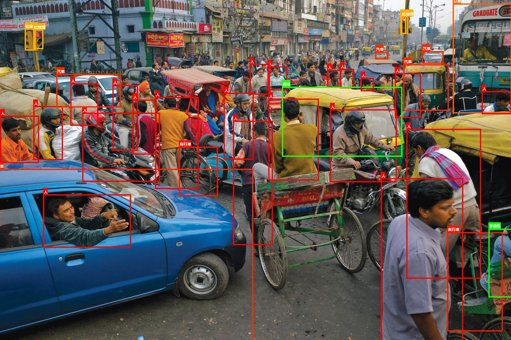
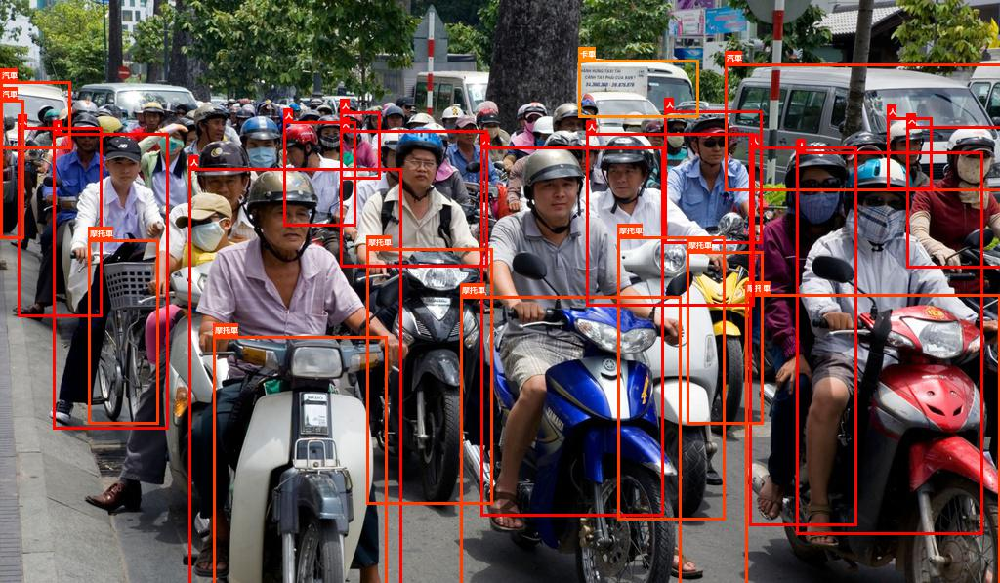

## Yolo v4 for pytorch (by trident api)

### thanks for
All the pretrined model weights and cfg is from official site:

https://github.com/AlexeyAB/darknet
[yolov4.cfg](https://raw.githubusercontent.com/AlexeyAB/darknet/master/cfg/yolov4.cfg)     
[yolov4.weights](https://drive.google.com/open?id=1cewMfusmPjYWbrnuJRuKhPMwRe_b9PaT)       

And thanks ultralytics's project, it's really great and helpful.     
https://github.com/ultralytics/yolov3

### results by yolo v4
Let's look  the excellent performance about yolo v4!!

this project is under my another project "trident", a higher order api both in pytorch and tensorflow, and I'll open-source soon.

本專案是基於我目前正在開發的另一個專案trident所開發的，它是一個整合pytorch與tensorflow動態計算圖的高階api，很快我就會將它開源，各位可以先從pip下載安裝。

### how to install 
trident only support python 3.x     
If you want to use pytorch api, you need pytorch 1.2 or higher
If you want to use tensorflow api, you need tensorflow 2.2rc0 or higher (because trident tensorflow  api  is pure eager mode "without keras, without static graph"")
You can install it from pip

`
pip install tridentx   --upgrade  
`

after installed trident, you can use following syntax to import it and assign the backed.
    
    import os  
    os.environ['TRIDENT_BACKEND'] = 'pytorch'  
    import trident as T  
    from trident import *  

### how to use
1. pytorch_yolo.py: it is just a basic library derived from trident , to define darknet and yolo basic block.      
2. pytorch_darknet.py: we can construction yolo v4 network and load pretrained weights here.    
3. pytorch_infer_yolo4.py: It's a demo to show how to do object detection by yolo v4 model and how trident api to make things easy.

You also can download my results in pytorch from google drive:
[pytorch pretrained model](https://drive.google.com/open?id=13P4yOdGrE_t0x_si5EaUjlAe_VMvMDBA)
[pytorch pretrained statedict](https://drive.google.com/open?id=1q2m_0GWSDgKcdtuoSwTXJGXs_DdsD3z-)

